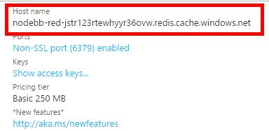

## Deploy NodeBB on Azure PaaS

**This deployment is for tests and development purpose** 

Automated deployment of NodeBB with the following resourses on Azure :
* Service Plan using Web App on linux (Preview) - Basic B1 Plan
* Redis Cache on PaaS - Basic C0 Plan
* WebApp hosted on the Service Plan calling the NodeBB Container : julienstroheker/nodebb-on-Azure

## Walktrough

1. Click on 
2. Give a name for the resource Group
3. Pick a location !! Because the **Service Plan on Linux is still in preview**, you can only pick the following one : **West Europe** - **Southeast Asia** - **West US** 
4. Fill the suffix field. This one allow you to name your ressources on Azure, for example if you enter 'julienstro' you will have the following name : 
    * nodebb-red-**julienstro**XXXXX (Redis resource)
    * nodebb-sp-**julienstro**XXXXX (Service Plan resource)
    * nodebb-web-**julienstro**XXXXX (Web App resource)
    > The XXXXX represent random char. generated during the deployement, it will help you to have unique names on Azure.
5. Tick "I agree to the ..." at the bottom and then click on **purchase**

    

6. Please allow a certain amont of time for the deployment of Redis
7. When you deployment is succeeded  browse you resource group and click on the **Redis Cache** Service

    

8. Copy the hostname 

    

9. Click on Show Access keys and copy your Primary keys

    

10. Back to your resource group, click now on your **App Service**

    

11. Click on the **URL**

    

12. A new tab will open, fill the NodeBB Installer informations with your parameters

    

13. And Voila you should be ready to use NodeBB on Azure !

    

## Questions 

Open an issue or reach me : [@ju_stroh](https://twitter.com/ju_stroh)
